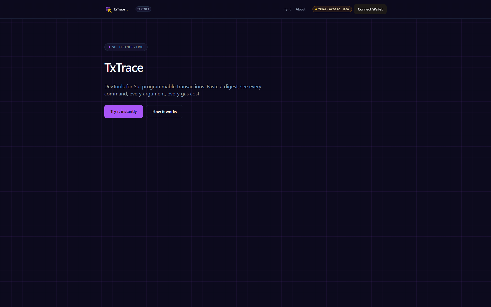
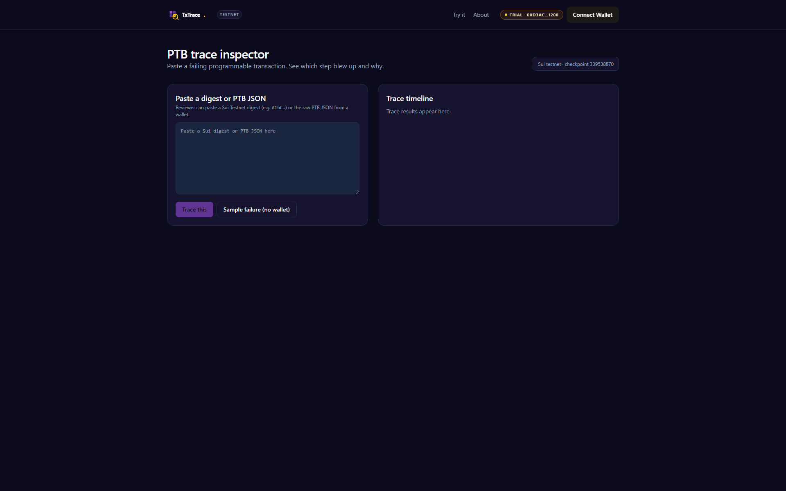

<p align="center">
  
</p>

<p align="center">
  <b>TxTrace</b> — AI-narrated post-mortems for any Sui transaction.
</p>

<p align="center">
  <a href="https://txtrace.veithly.workers.dev"></a>
  <a href="https://txtrace.veithly.workers.dev/app"></a>
  <a href="https://nextjs.org"></a>
  <a href="https://sui.io"></a>
  <a href="./LICENSE"></a>
</p>

<p align="center">
  
</p>

## Why TxTrace

Reading a Sui transaction in the explorer is reading machine code with no debugger. You see `0x..` digest, eighteen `ObjectChange` rows, a Move call graph, and event names — but no story of what actually happened or where it failed. TxTrace pastes the digest into a reasoning engine, walks the trace, and writes the post-mortem a senior engineer would have written: this happened, this almost happened, this is why it failed, fix it like this.

## What it does

Open the app. Paste a digest, or pick a sample failure from the picker. Click AI Root-Cause. The reasoning loop streams a structured report — call tree, event highlights, suspected root cause, suggested fix — citing exact `Module::function` lines and object IDs.

Download the report as markdown. Share the digest's `/trace/[digest]` page with a teammate; the report is cached so they read the same analysis. Click any object ID to jump to SuiVision; click any module to jump to the Move source.

<p align="center">
  
</p>

## Architecture

Next.js 15 + Mysten dApp Kit. The trace endpoint fetches the transaction via the Sui RPC, runs an LLM analysis pass with structured-output JSON mode, and caches the report in a SQLite-backed KV. A second pass extracts the call graph as a Mermaid diagram. Full pipeline in [`docs/ARCHITECTURE.md`](./docs/ARCHITECTURE.md).

## Quick start

```bash
pnpm install
cp .env.example .env.local   # fill SUI_FULLNODE_URL + LLM key (see below)
pnpm dev                     # http://localhost:3130
```

Required env vars:
- `SUI_FULLNODE_URL` — Sui Testnet RPC endpoint (default: `https://fullnode.testnet.sui.io:443`)
- `SUI_DEMO_PRIVATE_KEY` — Ed25519 secret key for the hosted-wallet ("Try instantly") flow. Leave blank to require a connected wallet.
- `STEPFUN_API_KEY` (or `OPENAI_API_KEY`) — reasoning engine key, only required for the AI-driven flows.

Production build + Cloudflare deploy:

```bash
pnpm build
pnpm run deploy   # opennextjs-cloudflare deploy
```

End-to-end smoke test:

```bash
pnpm test:e2e
```

## Tech stack

- **Next.js 15** App Router · React 19 · Tailwind v4 · shadcn/ui base
- **@mysten/dapp-kit-react** for wallet connection + transaction signing
- **@mysten/sui** for PTB construction + RPC
- **OpenNext** for Cloudflare Workers deployment
- **Playwright** for end-to-end test coverage

## License

MIT © veithly
