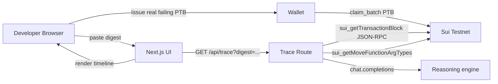

# TxTrace — Architecture

Engineering-peer overview of how TxTrace runs. Marketing copy lives in `README.md`; this document is the technical depth.

## Overview

TxTrace is the missing DevTools panel for Sui programmable transaction blocks. A developer pastes a failing PTB digest into the inspector and gets back a step-by-step timeline of the move calls, the move-level abort code (when one fired), the explorer link, and a reasoning summary of the most likely root cause. The product is intentionally read-only on chain — its only on-chain artefact is a tiny example module that lets the inspector reproduce a deterministic failing PTB on-demand for the "Issue + trace a real failure" CTA.



## On-chain data model — `txtrace_core::airdrop`

A tiny example module shipped only so the inspector has a deterministic failing PTB to demo against. Not a product surface — a fixture.

| Type | Fields | Notes |
| --- | --- | --- |
| `Registry` (key, shared) | `id`, `claimed: Table<address, bool>` | Single shared registry; `init_registry` is run once after publish. |
| `Claimed` event | `who: address` | Emitted on first successful claim by a sender. |

The fixture function `claim_batch(reg, ctx)` aborts with `EAlreadyClaimed = 1` on the second call from the same address. That assertion abort is the failing PTB the "Issue + trace a real failure" CTA produces — guaranteed reproducible, no external state.

## Frontend topology

| Surface | Route | Hero element |
| --- | --- | --- |
| Landing | `/` | Paste-pane mockup + before/after of "raw JSON-RPC" vs "TxTrace timeline" |
| App | `/app` | Digest paste pane, sample-failure CTA, real-failure CTA, timeline panel, AI root-cause panel |
| About | `/about` | Architecture + decoder rationale |

The trace timeline is built in `src/components/trace-console.tsx`. It accepts three input modes: connected-wallet real-failure (broadcasts a `claim_batch` PTB, waits for the abort, reads the digest from `result.FailedTransaction.digest`), sample-failure (a baked-in canned trace that doesn't touch chain), and paste-digest (any digest visible on the public testnet).

## Key flows

### 1. Real-failure path (wallet-connected)

1. Developer clicks **Issue + trace a real failure (your wallet)**.
2. Wallet signs `airdrop::claim_batch(reg, ctx)` for the second time from the same address.
3. PTB executes and aborts on `EAlreadyClaimed`. Browser captures `result.FailedTransaction.digest`.
4. Browser waits ~ 2 s for the testnet node to index the abort.
5. Browser GETs `/api/trace?digest=<digest>` — the path converges with #3.

### 2. Sample-failure path (no wallet)

1. Developer clicks **Sample failure (no wallet)**.
2. Browser loads a baked-in trace fixture (`src/lib/sample-trace.ts`).
3. UI renders the timeline + AI root-cause panel from local data.
4. Used for the "no install" judge flow and for offline testing.

### 3. Paste-digest path

1. Developer pastes any testnet digest into the pane.
2. Browser GETs `/api/trace?digest=<digest>`.
3. Server fetches the transaction block via JSON-RPC, resolves each move call's arg types, builds a step-by-step timeline.
4. If the tx failed, server forwards the abort code + module + function to the reasoning engine for a plain-English root cause summary.
5. UI renders the timeline + the AI panel.

## API surface

| Route | Method | Purpose |
| --- | --- | --- |
| `/api/network` | GET | Returns `{ network, demo: { configured, address } }` for the navbar pill. |
| `/api/trace` | GET | `?digest=...` → returns `{ steps, abort, suggestion }` where `suggestion` is the reasoning-engine output for failed PTBs (null on success). |

Both routes are App-Router Route Handlers, `runtime = "nodejs"`. The trace route does no on-chain writes — it only reads. The reasoning engine call is gated behind `STEPFUN_API_KEY || OPENAI_API_KEY` and falls back to a rule-based summary if neither is present.

## Decoder pipeline

The interesting bit is `src/lib/decoder.ts`. Given a `SuiTransactionBlockResponse`:

1. **Walk `transaction.data.transaction.kind.ProgrammableTransaction.transactions`** — extract every `MoveCall`, `SplitCoins`, `TransferObjects`, `MergeCoins`, `Publish`, `MakeMoveVec`.
2. **Resolve types** via `sui_getMoveFunctionArgTypes` so each step shows real Move types instead of opaque JSON-RPC payloads.
3. **Cross-reference effects** — match each transaction step to the relevant `mutatedObjects` / `createdObjects` / `deletedObjects` entry from `effects`.
4. **Detect aborts** — if `effects.status.status === "failure"`, parse the abort string (regex on `"MoveAbort(MoveLocation { module: ... }, <code>)"`), extract the module + function + code, and look it up in the decoder's known-error table.
5. **Forward to reasoning engine** — pass `{ module, function, abortCode, knownError? }` to `llmChat()` for a plain-English summary suitable for a developer who's never seen this module.

The decoder is a pure function — given the same `SuiTransactionBlockResponse`, it produces the same output. The reasoning engine output is the only nondeterministic layer, and it's clearly labelled as such in the UI.

## Environment

| Var | Used by | Notes |
| --- | --- | --- |
| `SUI_NETWORK` | server | `testnet` (default). |
| `SUI_FULLNODE_URL` | server | `https://fullnode.testnet.sui.io:443`. |
| `NEXT_PUBLIC_SUI_FULLNODE_URL` | client | Same value, exposed for dApp Kit. |
| `SUI_DEMO_PRIVATE_KEY` | server | Optional. Only used if a future "automated re-issue" feature lands; v0.1 is read-only. |
| `NEXT_PUBLIC_TXTRACE_PACKAGE_ID` | client | Move package id for the fixture module. |
| `NEXT_PUBLIC_TXTRACE_REGISTRY_ID` | client | Shared `Registry` object id. |
| `STEPFUN_API_KEY` + `STEPFUN_LLM_MODEL` | server | Primary reasoning provider for the root-cause panel. |
| `OPENAI_API_KEY` + `OPENAI_LLM_MODEL` | server | Fallback reasoning provider. |
| `NEXT_PUBLIC_APP_URL` | client | Used by share-card generation. |

## Deployment topology

```mermaid
flowchart LR
  user[Developer]
  user --> cf[Cloudflare Pages]
  cf -->|@cloudflare/next-on-pages| fn[Pages Functions]
  fn -->|JSON-RPC| node[Sui Testnet fullnode]
  fn -->|HTTPS| llm[OpenAI-compatible LLM]
  cf -->|static assets| user
```

Read-only product → smaller env surface, no demo signer required for the hero path, no per-user rate limit beyond Cloudflare's defaults. The fixture Move module is published once per environment; the package id is pushed to Cloudflare Pages env vars at deploy time.

## Security boundary

- Browser **never** sees `STEPFUN_API_KEY` or `OPENAI_API_KEY`.
- `/api/trace` is rate-limited per IP (Cloudflare Pages function rate limit) — the decoder is cheap but the reasoning engine call costs real money.
- All chain reads are public testnet data; no sensitive on-chain state is exposed.
- The fixture module is intentionally trivial and idempotent within a sender's lifetime; no risk vector for real funds.

## Trade-offs

| Decision | Why | Cost |
| --- | --- | --- |
| Read-only product, no signer in hero path | Lowest possible barrier for the no-install judge flow | Limits future "automated re-issue" / "fork-and-test" features without a signer |
| Pure decoder + AI summary separated | Decoder remains deterministic, AI is clearly nondeterministic | Two layers of code to keep in sync when Sui adds new tx kinds |
| Tiny fixture module just for the real-failure CTA | Lets reviewers see the wallet path without us hosting a contrived broken contract | One extra publish step per environment |
| File-backed trace cache (`.txtrace-data/`) | Sub-second repeat-lookups for popular digests | Cache invalidation is naïve (TTL only); will need KV / D1 for multi-region |
| Rule-based fallback when no LLM key | Product still works offline / on a stub env | The fallback summary is less helpful than the LLM one |
